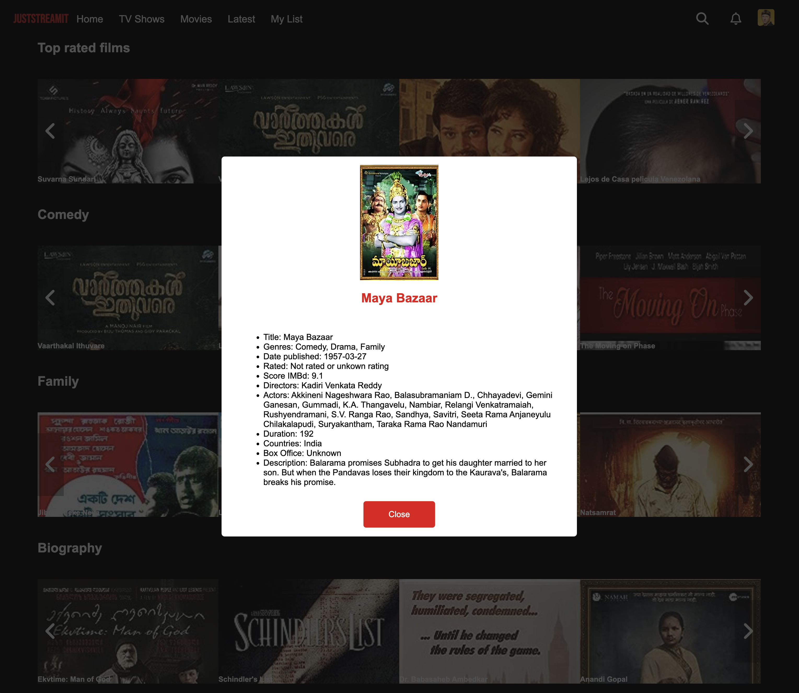

# OCMovies Web Application
   
   This web application is designed to display movies from the OCMovies-API, emulating the layout and experience similar to Netflix. It's built to work seamlessly on the three most popular browsers currently in use.
   
   ## Features

- **Featured Movie**: Highlights the movie with the top IMDb score, showcasing its image and title.
- **Top Rated Movies**: Showcases the next seven highest-rated movies across all categories with a scrolling feature..
- **Category Sections**: TThree specific movie categories - Comedy, Family, Biography - each displaying their top 7 films.
- **Pure vanilla JavaScript**:  Implemented without relying on external frameworks..
- **Modal window**: Presents comprehensive movie details..

When users click on a movie image film, a modal pops up, providing detailed information about the movie. This includes its title, genre, release date, IMDb score, director, list of actors, duration, country of origin, box office results, and a brief summary.

## Prerequisites

Make sure you have [Node.js](https://nodejs.org/) installed.
Make sure you have [OC Movies API](https://github.com/OpenClassrooms-Student-Center/OCMovies-API-EN-FR) set up and runing.

## Getting Started

1. **Clone the repository**:
   ```sh
   git clone https://github.com/ErnestoAquino/JustStreamIt.git
   cd JustStreamIt
   ```
1. **Open the file**:
    ```sh
    index.html
   ```

## Screenshots
### Screenshot of the window.


### Screenshot of the modal window.



## Acknowledgments
Inspired by the Netflix user interface.
OCMovies-API for providing the movie data.
